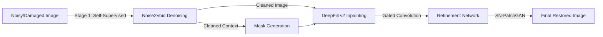

# 🎨 Enhanced Image Inpainting: DeepFill v2 + Noise2Void

A hybrid deep learning framework integrating self-supervised denoising (**Noise2Void**) with gated convolution inpainting (**DeepFill v2**) to restore noisy, damaged images with high fidelity.

📄 **Read the Research Paper:** [View PDF](./docs/image_inpainting_paper.pdf)

## 🏗️ Architecture Design

The system operates in a novel two-stage pipeline designed to handle real-world noisy data, which traditional inpainters often struggle with.



## 🛠️ Tech Stack

* **Deep Learning:** PyTorch, TensorFlow (Hybrid implementation).
* **Denoising:** Noise2Void (Blind-spot network for self-supervised learning).
* **Inpainting:** DeepFill v2 (Gated Convolutions to handle irregular masks).
* **Discriminator:** SN-PatchGAN (Spectral Normalization for training stability).
* **Metrics:** LPIPS, FID, PSNR, SSIM.

## 📊 Performance Benchmark

We evaluated the model on the **Places2 Dataset** (10M+ images). Our hybrid model achieves SOTA performance, outperforming the baseline DeepFill v2 by **17.4% in PSNR**.

| Model | FID (Lower is better) | PSNR (Higher is better) | SSIM | LPIPS |
| --- | --- | --- | --- | --- |
| **Proposed (N2V + DeepFill)** | **5.927** | **27.01** | **0.837** | **0.0172** |
| DeepFill v2 (Baseline) | 6.05 | 22.30 | 0.81 | 0.0178 |
| DeepFill v1 | 6.73 | 21.68 | 0.75 | 0.0400 |
| COMod GAN | 3.72 | 22.65 | 0.74 | 0.0250 |

## 🔧 Key Engineering Decisions

**1. Why Noise2Void (N2V) First?**

* **Problem:** Standard inpainters assume clean input. If the context (surrounding pixels) is noisy, the "filled" area becomes blurry or artifact-heavy.
* **Solution:** We implemented N2V as a pre-processing stage. It requires *no clean ground truth* data, allowing it to adapt to real-world noise distributions unsupervised.

**2. Gated Convolution vs. Vanilla Convolution**

* **Decision:** Replaced standard convolutions with Gated Convolutions.
* **Reasoning:** Standard convolutions treat "masked" (missing) pixels as valid inputs, creating edge artifacts. Gated convolutions learn a dynamic feature selection mechanism, effectively "ignoring" the hole during the encoding phase.

**3. Spectral Normalization (SN-PatchGAN)**

* **Decision:** Used SN-PatchGAN for the discriminator.
* **Impact:** Stabilized the GAN training by constraining the Lipschitz constant, preventing mode collapse and ensuring consistent texture generation.

## 🚀 How to Run

1. **Clone the repository:**
```bash
git clone [https://github.com/YOUR_USERNAME/DeepFill-N2V-Inpainting.git](https://github.com/YOUR_USERNAME/DeepFill-N2V-Inpainting.git)
cd DeepFill-N2V-Inpainting

```


2. **Install dependencies:**
```bash
pip install -r requirements.txt

```


3. **Run the Inference Pipeline:**
```bash
python inference.py --input examples/noisy_image.jpg --mask examples/mask.png

```


## 🔗 Citation

If you find this work useful, please cite our paper:

> **M. Elharmil, M. Merghany, S. Youssef**, "An Enhanced Integrated Model for Image Inpainting Using Gated Convolution Spectral Normalized SN-Patch," AASTMT, 2024.

```


