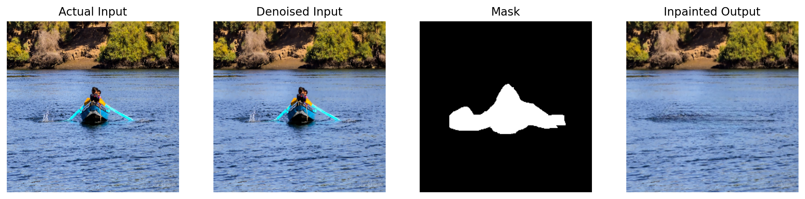

# 🎨 Enhanced Image Inpainting: DeepFill v2 + Noise2Void

A hybrid deep learning framework integrating self-supervised denoising (**Noise2Void**) with gated convolution inpainting (**DeepFill v2**) to restore noisy, damaged images with high fidelity.

**Engineered a hybrid deep learning model** integrating DeepFillv2 and Noise2Void concepts to improve image inpainting on noisy images. Implemented and trained the GAN model using PyTorch, TensorFlow, and OpenCV, conducting rigorous ablation studies and performance benchmarking on the Places2 dataset.

📄 **Published Research:** [Read on IEEE Xplore](https://ieeexplore.ieee.org/document/10580110) | [View Local PDF](docs/Research_Paper.pdf)

## 👁️ Visual Results

The pipeline first denoises the input to prevent artifacts, then generates the missing region.


*(Left to Right: Original Noisy Input, Denoised Output, Mask, Final Inpainted Result)*


## 🏗️ Architecture Design

The system operates in a novel two-stage pipeline designed to handle real-world noisy data, which traditional inpainters often struggle with. Below is the detailed architecture proposed in our research paper.


*(Figure 1: The proposed integrated model architecture combining Noise2Void (N2V) preprocessing with the Gated Convolution based DeepFillv2 inpainting network.)*


## 🛠️ Tech Stack

* **Deep Learning:** PyTorch, TensorFlow (Hybrid implementation).
* **Denoising:** Noise2Void (Blind-spot network for self-supervised learning).
* **Inpainting:** DeepFill v2 (Gated Convolutions to handle irregular masks).
* **Discriminator:** SN-PatchGAN (Spectral Normalization for training stability).
* **Libraries:** OpenCV, NumPy, Matplotlib.

## 📊 Performance Benchmark

We evaluated the model on the **Places2 Dataset** (10M+ images). Our hybrid model achieves SOTA performance, outperforming the baseline DeepFill v2 by **17.4% in PSNR**.

| Model | FID (Lower is better) | PSNR (Higher is better) | SSIM | LPIPS |
| --- | --- | --- | --- | --- |
| **Proposed (N2V + DeepFill)** | **5.927** | **27.01** | **0.837** | **0.0172** |
| DeepFill v2 (Baseline) | 6.05 | 22.30 | 0.81 | 0.0178 |
| DeepFill v1 | 6.73 | 21.68 | 0.75 | 0.0400 |
| COMod GAN | 3.72 | 22.65 | 0.74 | 0.0250 |

## 🔧 Key Engineering Decisions

**1. Why Noise2Void (N2V) First?**

* **Problem:** Standard inpainters assume clean input. If the context (surrounding pixels) is noisy, the "filled" area becomes blurry or artifact-heavy.
* **Solution:** We implemented N2V as a pre-processing stage. It requires *no clean ground truth* data, allowing it to adapt to real-world noise distributions unsupervised.

**2. Gated Convolution vs. Vanilla Convolution**

* **Decision:** Replaced standard convolutions with Gated Convolutions.
* **Reasoning:** Standard convolutions treat "masked" (missing) pixels as valid inputs, creating edge artifacts. Gated convolutions learn a dynamic feature selection mechanism, effectively "ignoring" the hole during the encoding phase.

**3. Spectral Normalization (SN-PatchGAN)**

* **Decision:** Used SN-PatchGAN for the discriminator.
* **Impact:** Stabilized the GAN training by constraining the Lipschitz constant, preventing mode collapse and ensuring consistent texture generation.

## 🚀 How to Run

1. **Clone the repository:**
```bash
git clone [https://github.com/menna-marghany/DeepFill-N2V-Inpainting.git](https://github.com/menna-marghany/DeepFill-N2V-Inpainting.git)
cd DeepFill-N2V-Inpainting

```


2. **Install dependencies:**
```bash
pip install -r requirements.txt

```


3. **Run the Inference Pipeline:**
```bash
python inference.py

```


## 🔗 Citation

> **M. Elharmil, M. Merghany, S. Youssef**, "An Enhanced Integrated Model for Image Inpainting Using Gated Convolution Spectral Normalized SN-Patch Generative Adversarial Networks," *2024 International Conference on Machine Intelligence and Smart Innovation (ICMISI)*, Alexandria, Egypt, 2024, pp. 1-7. DOI: [10.1109/ICICIS61608.2024.10580110](https://ieeexplore.ieee.org/document/10580110).

```

